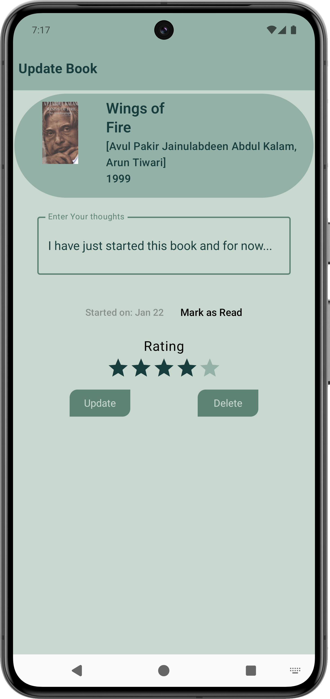

# Bibliophile's Journal - Your Personalized Book Tracker | [Website](https://yourwebsite.com/BibliophilesJournal)

## Introduction

Bibliophile's Journal is the ultimate tool for book lovers to track, review, and manage their reading journey. Designed with an intuitive interface and rich features, it empowers readers to create their own literary haven, making reading even more enjoyable.

## Key Features
- **Personalized Book Tracker**: Add, edit, and categorize books based on your reading goals.
- **Reading History**: Track books you've read, along with completion dates and reviews.
- **Wishlist**: Maintain a list of books you want to read in the future.
- **Rating and Reviews**: Add ratings and detailed reviews for books you've completed.
- **Custom Categories**: Organize books by genres, authors, or personal categories.
- **Search and Filter**: Quickly find books using the powerful search and filtering options.
- **User-Friendly Design**: A clean and immersive UI/UX tailored for book enthusiasts.

## Media Gallery

<!-- 2x3 Grid with Images -->
<table style="width:100%;">
  <tr>
    <!-- First row: 3 images -->
    <td style="padding: 10px;">
      
    </td>
    <td style="padding: 10px;">
      
    </td>
    <td style="padding: 10px;">
      
    </td>
  </tr>
  <tr>
    <!-- Second row: 3 images -->
    <td style="padding: 10px;">
      
    </td>
    <td style="padding: 10px;">
      
    </td>
    <td style="padding: 10px;">
      
    </td>
  </tr>
  <tr>
    <!-- Third row: 3 images -->
    <td style="padding: 10px;">
      
    </td>
    <td style="padding: 10px;">
      
    </td>
  </tr>
</table>

## Technical Details
- **Architecture**: MVVM (Model-View-ViewModel) for efficient and maintainable code
- **Database**: Room Database for offline storage of book data
- **User Interface**: Built with Jetpack Compose for dynamic and responsive UI
- **Data Handling**: Kotlin coroutines and Flow for seamless asynchronous operations
- **Navigation**: Jetpack Navigation Component for smooth navigation between screens

## Tools & Libraries
- **Languages**: Kotlin
- **Database**: Room Database
- **UI/UX**: Jetpack Compose, Material Design
- **Dependencies**: Hilt for Dependency Injection, Kotlin Coroutines for background tasks

## Outcomes
- Created a comprehensive tool for book lovers to track and organize their reading habits
- Leveraged modern Android frameworks to build a seamless and efficient user experience
- Gained in-depth knowledge of Jetpack Compose and MVVM architecture

## Key Challenges & Solutions
- **Challenge**: Designing an intuitive UI for diverse user needs
  - **Solution**: Conducted user research and implemented Material Design principles for simplicity and accessibility
- **Challenge**: Managing offline data persistence
  - **Solution**: Integrated Room Database with Kotlin Flow to ensure real-time updates and offline support

## Future Enhancements
- Add integration with Goodreads API for automatic book data retrieval
- Implement social features to share reviews and recommendations with friends
- Introduce push notifications for reminders and reading goals
- Enable cloud sync for cross-device compatibility

## Acknowledgments

- [Google Books API](https://developers.google.com/books)
- [Firebase Firestore](https://firebase.google.com/docs/firestore)
- [Jetpack Compose Documentation](https://developer.android.com/jetpack/compose)
